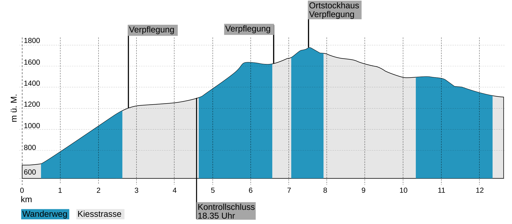

# Belvedere

`12.6 km` · `+1200 Hm` · `Advanced` · `Mountain Race`

---

## Start

**17:30 Uhr – Linthal Braunwaldbahn (Talstation)**  
👉 Wertung im Glarner Laufcup

---

## Highlights

- Start im Tal → alpiner Aufstieg  
- Reha Klinik *(Verpflegung)*  
- Unterstafel → Brächalp *(Verpflegung)*  
- Ortstockhaus *(höchster Punkt, Verpflegung)*  
- Technische Wurzeltrails  
- Ziel: Hüttenberg Braunwald  

---

## Charakter

- 🔴 **Kondition:** hoch  
- 🟡 **Technik:** mittel  
- 🔵 **Erlebnis:** alpin & spektakulär  

👉 Für ambitionierte Bergläufer:innen

---

## GPX

[Download GPX](https://drive.google.com/uc?export=download&id=1CBSeHTccnaGSeHnDVldQS8x5gTrYlJcO)

---

## Karte

<iframe src='https://map.geo.admin.ch/embed.html?lang=de&topic=ech&bgLayer=ch.swisstopo.pixelkarte-farbe&layers=ch.swisstopo.zeitreihen,ch.bfs.gebaeude_wohnungs_register,ch.bav.haltestellen-oev,ch.swisstopo.swisstlm3d-wanderwege,KML%7C%7Chttps:%2F%2Fpublic.geo.admin.ch%2Fapi%2Fkml%2Ffiles%2FHtTqZdT6SnuME_euMp_wPg&layers_opacity=1,1,1,0.8,1&layers_visibility=false,false,false,false,true&layers_timestamp=18641231,,,,&E=2717017.78&N=1199982.43&zoom=5.2' height='400' frameborder='0' style='width: 100% !important; border:0;'></iframe> 

---

## Höhenprofil

