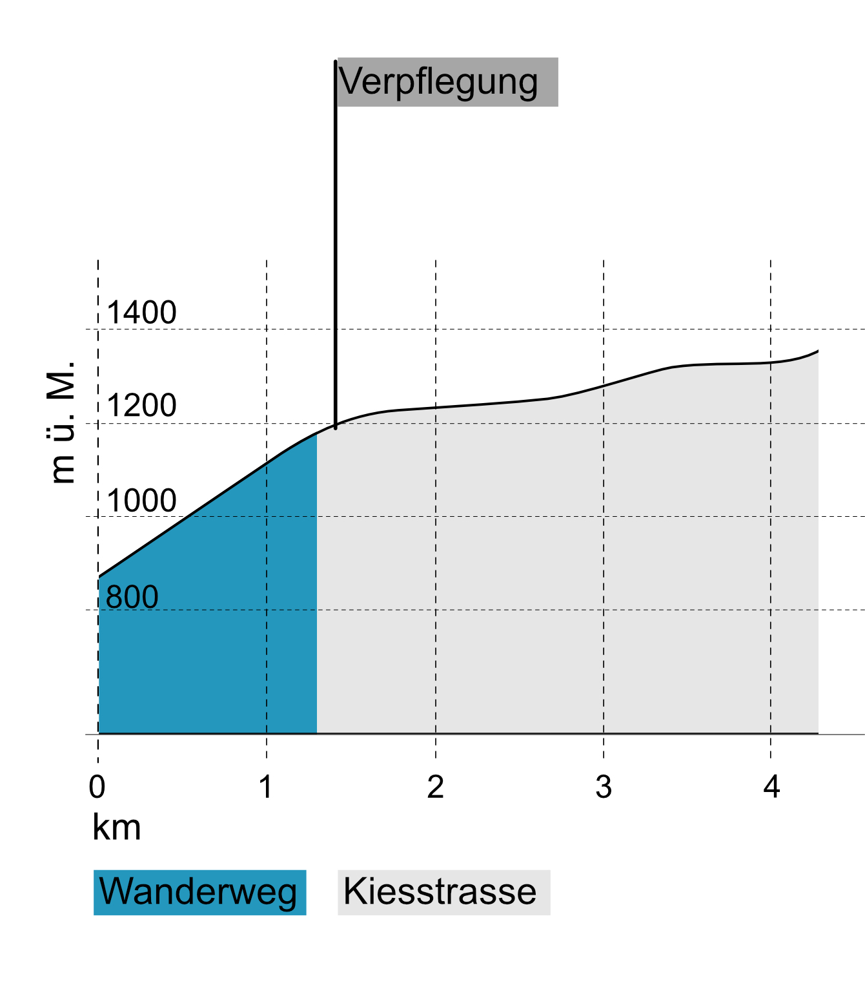

### Start um 18.30 ab Braunwald Reha Klinik

#### Strecke & Highlight
- Start: Braunwald Reha Klinik
- Ein Genusslauf in schönster Bergkulisse
- Kinder und Jugendlauf
- Ziel: Braunwald Hüttenberg
- Run for Fun Kategorie - Keine Rangliste nur Finisher Geschenk
- Rangliste U14 und U16 Kategorien

**Hinweis:** Die Run for Fun Kategorie hat keine Zeitwertung, die Teilnehmenden werden entsprechend nicht in die Cupwertung, aber in der Finisherwertung des Glarner Laufcups aufgenommen. <a href="https://glarnerlaufcup.ch/reglement/" target="_blank">Reglement GLC</a>

[GPX Track Download](https://drive.google.com/file/d/1GnvPv9Q9-3_QCD-7Eq8aGeEAlXMZsELZ/view?usp=sharing)

<iframe src="https://map.geo.admin.ch/#/embed?lang=en&center=2717971.95,1199682.02&z=9&topic=ech&layers=ch.swisstopo.zeitreihen@year=1864,f;ch.bfs.gebaeude_wohnungs_register,f;ch.bav.haltestellen-oev,f;ch.swisstopo.swisstlm3d-wanderwege,f;ch.vbs.schiessanzeigen,f;ch.astra.wanderland-sperrungen_umleitungen,f;KML%7Chttps://public.geo.admin.ch/api/kml/files/hdbll-sARGGKtvHs2CHhPA&bgLayer=ch.swisstopo.swissimage&featureInfo=default" style="border: 0;width: 800px;height: 600px;max-width: 100%;max-height: 100%;" allow="geolocation"></iframe>

  
#### Höhenprofil

  
 
    
  

